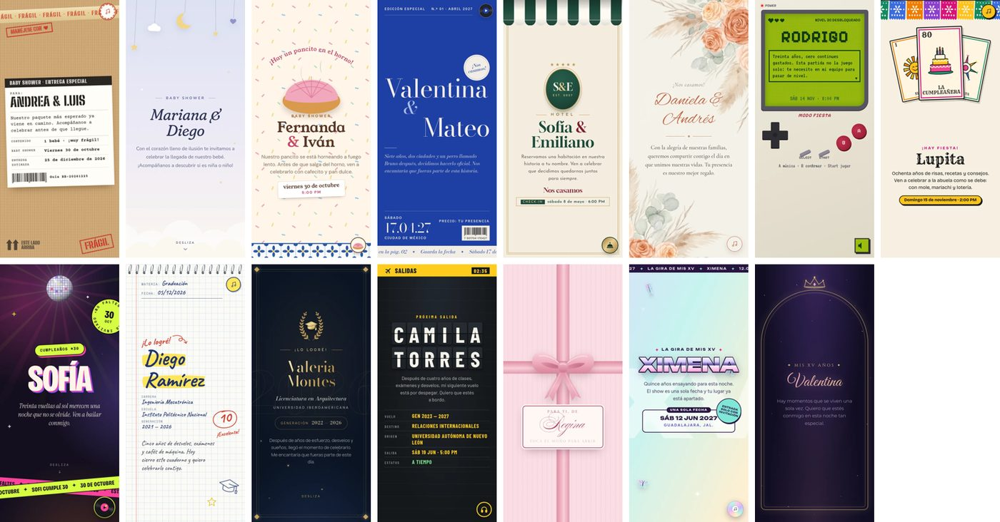
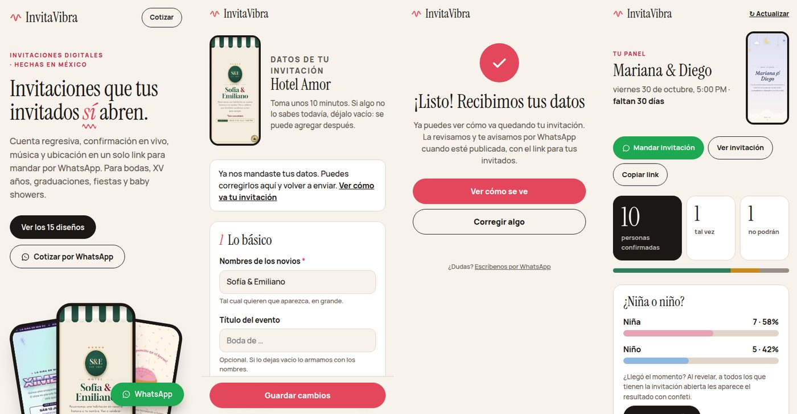

# InvitaVibra · Invitaciones digitales interactivas

[](https://github.com/Fabrizio-Espinoza/Project-Digital-Invitations/actions/workflows/pruebas.yml)


**🔗 En producción:** **[invitavibra.pythonanywhere.com](https://invitavibra.pythonanywhere.com)**

Plataforma para vender invitaciones digitales en México (bodas, XV años, graduaciones, fiestas y baby showers). Cada invitación es un link que se manda por WhatsApp. Trae cuenta regresiva, confirmación de asistencia en vivo, música, ubicación, galería y se puede instalar como app. No es un proyecto de práctica: está desplegado, con HTTPS, y es la base de un negocio real.



## Pruébalo

| | |
|---|---|
| Catálogo con los 15 diseños | [invitavibra.pythonanywhere.com](https://invitavibra.pythonanywhere.com) |
| Boda · Hotel Amor | [/invitaciones/demo-hotel-amor/](https://invitavibra.pythonanywhere.com/invitaciones/demo-hotel-amor/) |
| XV años · La Gira | [/invitaciones/demo-xv-ximena/](https://invitavibra.pythonanywhere.com/invitaciones/demo-xv-ximena/) |
| Graduación · Próxima Salida | [/invitaciones/demo-graduacion-camila/](https://invitavibra.pythonanywhere.com/invitaciones/demo-graduacion-camila/) |
| Fiesta · Nivel Desbloqueado | [/invitaciones/demo-fiesta-rodrigo/](https://invitavibra.pythonanywhere.com/invitaciones/demo-fiesta-rodrigo/) |
| Baby shower · Pancito en el Horno | [/invitaciones/demo-baby-pancito/](https://invitavibra.pythonanywhere.com/invitaciones/demo-baby-pancito/) |

Se ven mejor en el celular. En los demos puedes confirmar asistencia, votar "¿niña o niño?" y agendar la fecha: todo funciona.

## Qué hace

**Para el invitado**
- 15 diseños con concepto propio (un hotel boutique, un tablero de aeropuerto que gira, una consola retro con botones que sí funcionan, cartas de lotería…). Todo el arte es SVG/CSS propio y las tipografías son de licencia libre (OFL).
- Confirmación de asistencia con conteo en vivo, cuenta regresiva, botón a Google Maps, archivo `.ics` para el calendario y música con un toque.
- Juego en vivo "¿Niña o niño?" para baby showers: cuando los papás revelan el resultado, a todos los que tienen la invitación abierta les aparece con confeti.
- PWA: se instala en la pantalla de inicio y abre sin señal (service worker propio).

**Para el negocio**
- **Catálogo** como página principal, con filtros por evento (`/#xv`) y un botón "La quiero" que abre WhatsApp con el diseño ya escrito.
- **Formulario para el cliente**: link privado donde llena sus datos desde el celular. Cambia según el evento, el paquete y el diseño, y arma la invitación sola, sin capturar nada a mano. La vista previa lleva marca de agua hasta que se publica.
- **Panel del anfitrión**: link privado donde el cliente ve quién confirmó, cuántas personas van, los mensajes de sus invitados; descarga la lista para Excel y revela el resultado de la votación.



## Cómo está hecho

- **Django 6.1 + Python 3.13**, SQLite, HTML/CSS/JavaScript vanilla (sin frameworks de frontend ni librerías de animación).
- **Motor + plantillas:** `base_interactiva.html` tiene toda la lógica (RSVP por `fetch`, countdown, scroll por pantallas, votación). Cada diseño es un archivo que solo cambia estilos y decoración con ``, así un arreglo en el motor lo heredan los 15.
- **Datos flexibles:** lo que cambia por tipo de evento (ceremonia, padrinos, fecha de parto, carrera…) vive en un `JSONField`; lo común, en columnas reales. Así un tipo de evento nuevo no necesita migraciones.
- **Niveles de paquete:** la vista cruza lo que pagó el cliente con lo que soporta el diseño, para que nadie vea funciones que no compró.

## Listo para producción

Desplegado en PythonAnywhere con HTTPS (Let's Encrypt). La guía completa está en [DESPLIEGUE.md](DESPLIEGUE.md).

- Settings separados: `DEBUG=False`, secretos en `.env` y el sitio no arranca si falta uno.
- Cookies seguras, CSRF, admin en una ruta propia y páginas 404/500 sin detalles técnicos.
- **Anti-spam** en confirmaciones y votos: límite por conexión y por invitación (429 + `Retry-After`), con la IP guardada solo como hash.
- Validación del RSVP en el servidor y protección contra doble envío.
- Fotos de clientes verificadas, redimensionadas y **sin datos EXIF/GPS**.
- **Aviso de privacidad** (LFPDPPP) y borrado automático de respuestas 90 días después del evento.
- **Respaldos** diarios de la base con la API de backup de SQLite, revisión de integridad y rotación.
- Revisiones propias en `manage.py check --deploy` (datos del aviso, WhatsApp, ruta del admin).
- **Pruebas automáticas** (unitarias y de integración) que corren en GitHub Actions con cada cambio.

## Correrlo en tu compu

```bash
git clone https://github.com/Fabrizio-Espinoza/Project-Digital-Invitations.git
cd Project-Digital-Invitations
python3.13 -m venv venv && source venv/bin/activate
pip install -r requirements.txt
python manage.py migrate
python manage.py crear_todos_los_demos     # crea los 15 demos e imprime sus links
python manage.py runserver
```

Pruebas: `python manage.py test invitaciones`

---

Hecho por **Fabrizio Espinoza Hurtado**.
